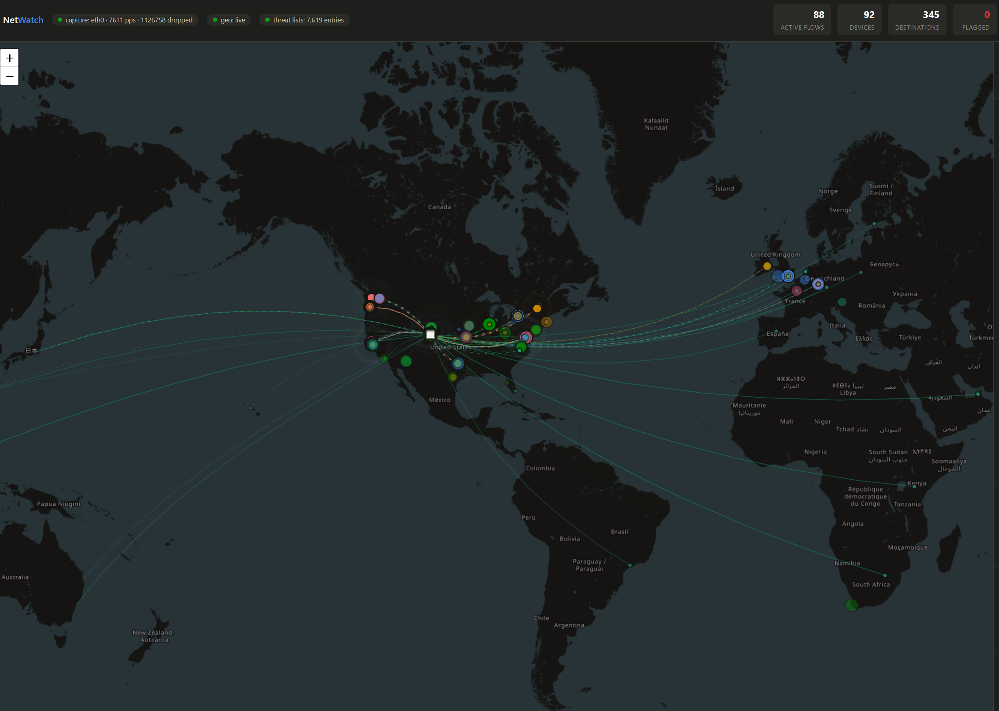
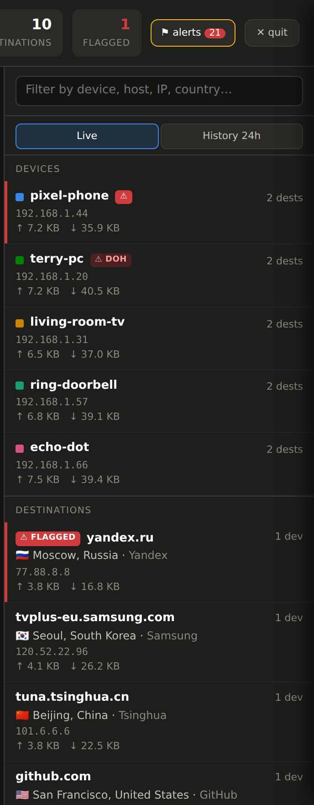
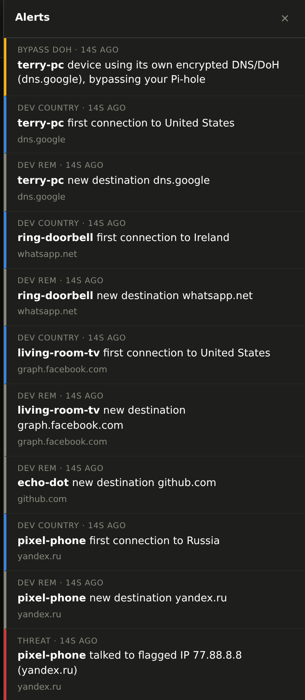

# NetWatch

**A live, network-wide world map of every device's internet connections — with
alerts, threat-intelligence flagging, history, and Pi-hole-bypass detection.**


-lightgrey)

-brightgreen)

NetWatch runs on a small always-on Linux box (a Raspberry Pi is ideal), watches a
**mirrored switch port**, and maps the real outbound connections of *every* device
on your LAN — phones, TVs, IoT and all — with the true remote IP, destination port,
and (for most HTTPS) the site's hostname read from the TLS SNI. It geolocates each
destination and plots it, colored by which device is responsible.

It also **alerts** on unusual activity, **flags known-bad IPs** against public
blocklists, keeps **30 days of history**, tracks **data volume** per device, and
detects devices trying to **bypass your Pi-hole** with their own external or
encrypted (DoH) DNS.

Pure Python 3 standard library — **nothing to install**.

> Just want to map a **single computer** without any switch setup? See the sibling
> project **[NetMap](../../netmap)**.

---

## Screenshots



*A live world map with animated arcs from your network to every remote endpoint,
colored by device — flagged/threat destinations glow red.*

| Devices & destinations | Alerts feed |
|---|---|
|  |  |

*Devices are color-coded with upload/download totals and badges for threats or
Pi-hole bypass; the alerts feed is severity-coded.*

---

## Features

- **Whole-network visibility** from one mirrored port — every device, all protocols
- **Real endpoints + hostnames** (TLS SNI), not just DNS domains — catches traffic
  that never does a DNS lookup (hardcoded IPs, IoT phone-homes)
- **Alerts** on a device reaching a new country, hitting a known-bad IP, or
  bypassing your Pi-hole — in-app plus optional phone push (ntfy), webhook, or email.
  Each device's DNS-bypass to a given resolver alerts **twice, then goes quiet for
  good** (survives clearing alerts and restarts); a *new* resolver alerts again.
  Every attempt is still logged and rolled up in the digest's DNS-server list
- **Threat-intelligence flagging** against Tor exit nodes, FireHOL level-1, and
  Spamhaus DROP (auto-refreshed); flagged destinations turn red, and the dashboard
  names *which* list matched rather than just showing a red dot
- **Flagged & inbound are events, not live flows** — a blocklist hit or an
  unsolicited inbound connection stays on the header counter and in the side panel
  for a retention window (6h by default, `event_retain_hours`), and is saved to the
  database so a restart doesn't blank the counters. Both tiles share one window, so
  flagged never drains faster than inbound
- **Click anything for details** — a flagged row, an alert, a destination, a digest
  threat hit, or a top talker opens a drawer explaining what the address is: geo and
  ISP, which blocklist flagged it and what that list means, every device that talked
  to it, ports, hostnames, volume, 30 days of history, and every related alert
- **Digest** (on-screen panel + optional weekly email) with top talkers, countries,
  alert counts, threat hits, and a **deduplicated list of every DNS server/resolver
  devices tried to reach** — a ready-made blocklist for your firewall or ACLs
- **History** saved to SQLite with a 24-hour look-back view; 30-day retention
- **Data volume** (↑ upload / ↓ download) per device and destination, with map arcs
  weighted by volume so a large transfer never looks like a keepalive
- **Visualizations panel** — four ways of reading the same window: *Constellation*
  (which device talks to which destination), *Flow* (a Sankey of bytes by country),
  *Weather* (activity by hour, or a day × hour heatmap over longer windows), and
  *Fingerprint* (each device's learned normal)
- **Device fingerprinting** — NetWatch learns each device's normal hours, ports,
  hourly volume and destination breadth, then alerts when one deviates. IoT gear is
  boringly consistent, which is exactly what makes a doorbell suddenly uploading
  200 MB at 3am to fifty new hosts worth knowing about
- **Destination notes** — annotate any IP, hostname or `*.domain` with your own
  verdict ("Syncthing relay — expected"), from the dashboard or a JSON file, so a
  destination you've already vetted stops looking suspicious
- **IPv6 leak alerts** — on a network run deliberately IPv4-only, any global v6
  traffic is a misconfiguration or a device routing around your v4 firewall rules
- **Process attribution (optional)** — a mirrored port can never see *which program*
  opened a socket. Run [`netwatch_agent.py`](netwatch_agent.py) on a PC you care
  about and its flows gain process names, while every other device is unaffected
- **Pi-hole bypass detection** — flags devices doing their own external DNS,
  DoT (port 853), or DoH; the digest's **DNS list** tab is a cumulative, deduplicated
  blocklist split into firewall-blockable IPs and Pi-hole-blockable domains
- **Friendly device names** — reverse-DNS/MAC-vendor by default, plus an optional
  manual name map (any switch/controller that can export a client list works)
- **Unsolicited-inbound detection** — flags TCP connections opened *to* your devices
  from the internet
- Per-device map filtering, a searchable side panel, and a dark themed UI that also
  works on a phone

## How it works (and its limits)

- The switch **mirrors** every packet crossing your internet uplink to a spare
  port; the Pi's wired NIC reads the copies.
- NetWatch parses only packet **headers** — addresses, ports, TLS SNI hostnames,
  and DNS answers. **No payloads are stored.** The only data leaving your network
  is the set of remote IPs sent to [ip-api.com](https://ip-api.com) for
  geolocation (cached locally).
- It records **outbound** flows (a LAN device → a public IP), and separately flags
  **unsolicited inbound** TCP connections opened *to* your devices from the internet.
- HTTPS/TLS-over-TCP usually reveals the hostname via SNI. QUIC (UDP/443) is
  encrypted, so those show the real IP + reverse-DNS but not always a clean host.
- Under a fully saturated gigabit transfer the Pi may drop some mirrored packets
  (shown in the header). Harmless here — we only need *which* endpoints, not bytes.

## Requirements

- A Linux capture box with two network paths (a Raspberry Pi 4/5 is perfect: wired
  Ethernet for the mirror, Wi-Fi for its normal connection)
- A **managed switch with port mirroring** (also called **SPAN** or a
  **monitor/mirror port**). This is the one hard requirement — it's what lets the
  Pi see other devices' traffic. Most managed/"smart" switches from any vendor
  support it; consult your switch's manual for the exact menu name.
- Python 3.9+ and root (raw packet capture)

---

## Setup

### 1. Wire it up

- **Pi Ethernet (eth0)** → the switch's **mirror/monitor port** (a receive-only
  copy of traffic).
- **Pi Wi-Fi (wlan0)** → your normal network (for geolocation and serving the map).
  Connect Wi-Fi first so the Pi stays reachable.

**Which port to mirror?** Mirror the port carrying all internet traffic — the link
between your switch and your router. If devices are split across two switches,
mirror on the switch the router plugs into and add the inter-switch link as a
second source port.

### 2. Enable port mirroring on the switch

Every managed switch calls this something slightly different — **port mirroring**,
**SPAN**, or a **monitor session** — but the concept is identical: pick a
**destination/monitor port** (where the Pi plugs in) and one or more **source
ports** to copy, and set the direction to **both** (ingress + egress). Apply, and
the Pi's mirror NIC will start seeing copies of that traffic.

General steps (adapt to your switch's UI/CLI):

1. Find the mirroring/SPAN feature in your switch's management interface.
2. Set the **destination** (monitor) port to the port the Pi's Ethernet is on.
3. Set the **source** port(s) to the uplink identified in step 1 (plus any
   inter-switch link).
4. Set direction to **both**, then apply/save.

If you're not sure whether your switch supports it, look for "mirror," "SPAN," or
"monitor" in its manual. Unmanaged switches do **not** support this.

### 3. Put it on the Pi

```bash
sudo mkdir -p /opt/netwatch
sudo cp netwatch.py /opt/netwatch/
sudo ip link set eth0 up          # the mirror port won't get an IP; that's fine
```

### 4. Run it

```bash
sudo python3 /opt/netwatch/netwatch.py --iface eth0 --pihole 192.168.1.2
```

Open **`http://<pi-wifi-ip>:8339`** from any browser on your network. The header's
**capture** pill should show packets-per-second climbing. Pass `--pihole` with each
Pi-hole IP so bypass detection knows which resolvers are sanctioned.

Preview the UI with fake traffic (no mirror, no root):

```bash
python3 netwatch.py --demo --host 127.0.0.1
```

| Flag | Description |
|------|-------------|
| `--iface NAME` | Capture interface (default `eth0`) |
| `--pihole IP` | Your Pi-hole IP(s); repeatable |
| `--port N` | Web server port (default 8339) |
| `--home LAT,LON` | Set map location manually |
| `--no-alerts` | Collect data but never send notifications |
| `--demo` | Synthesize traffic to preview the UI |

### 5. Run as a service (always-on)

```bash
sudo cp netwatch.service /etc/systemd/system/
# edit the ExecStart path/flags if needed (add your --pihole IP here)
sudo systemctl daemon-reload
sudo systemctl enable --now netwatch
```

### 6. Alerts & config (optional)

In-app alerts always work. For phone/email/webhook notifications and tuning, copy
[`netwatch.conf.example`](netwatch.conf.example) to `netwatch.conf` next to the
script and edit it (Pi-hole IPs, warm-up window, ntfy/webhook/email channels).
The config stays on your Pi and is read locally.

Alert severities: **critical** (threat-list hit), **warning** (Pi-hole bypass and
unsolicited inbound), **notice** (new country, new device), **info** (new
destination, if enabled).

The header's **flagged** and **inbound** tiles are *event* counters, not live-flow
counters. A blocklist hit or an inbound connection attempt stays counted for
`event_retain_hours` (default 6) after its last sighting and is persisted to the
database, so it behaves like its alert instead of disappearing when the underlying
flow ages out of the 2-minute flow table — and both tiles use the same window, so
flagged can never expire before inbound. Click either tile to jump to its list.

To keep the feed readable, a device's **DNS-bypass to any given resolver alerts
twice, then stops permanently** — the count is remembered across clearing alerts
and across restarts, so you won't keep seeing the same device→resolver pair. A
device reaching a *brand-new* resolver alerts again (twice). This only limits the
*alerts*; every bypass attempt is still recorded, and every resolver ends up in
the digest's DNS-server list below (your ready-made blocklist).

### 7. The digest & the DNS-server blocklist

Click **☰ digest** in the header for an on-screen summary of the last 24 hours /
7 / 30 days: top talkers, destinations, countries, alert counts, threat hits, and
a **deduplicated list of every DNS server or resolver your devices tried to reach**
while bypassing your sanctioned DNS. That list is exactly what you'd paste into a
firewall rule or ACL/IP group to block them. Enable `weekly_digest` (with email
configured) in `netwatch.conf` to also receive this as a weekly email.

### 8. Investigating something suspicious

Anything that names a remote address is clickable, and opens a **detail drawer** for
it: a flagged row or inbound row in the side panel, the ⓘ on a destination, a row in
the alerts feed, a threat hit or top destination in the digest. The drawer answers
"what actually is this?" in one place:

- **the verdict** — whether it's on a blocklist, *which* one(s), and what a hit on
  that particular list means (a Tor exit node is a very different story from a
  Spamhaus DROP netblock)
- **identity** — hostnames seen via TLS SNI and DNS, reverse DNS, city/country, ISP
  and organisation
- **who touched it** — every device, with ports, protocol, and volume; live flows
  now, retained flagged contacts, unsolicited inbound attempts, and per-device
  history over the 30-day retention
- **every alert** NetWatch has raised that named the address

From there you can filter the whole dashboard to that address, jump to it on the
map, or copy it for a firewall rule.

### 9. Naming your devices (optional)

By default NetWatch names each device by reverse-DNS (the hostname it registered
via DHCP), falling back to its MAC vendor, then its IP. To show your own friendly
names instead — handy for IoT gadgets that announce nothing — copy
[`netwatch_names.json.example`](netwatch_names.json.example) to `netwatch_names.json`
next to the script and map each device's **MAC** (any spelling) or **IP** to a
name. These take top priority. A MAC key is best since it survives IP changes.
Adding a name applies within a few seconds; removing one needs a restart. If your
switch or controller can export a client list, you can build this file from that
export rather than typing names by hand.

### 10. Annotating destinations (optional)

Most of the noise in a network monitor is destinations you have already decided are
fine. Click the **(i)** on any destination and write a note — it appears next to
that address everywhere afterwards, including the map tooltip. Notes are stored in
`netwatch_notes.json`; see
[`netwatch_notes.json.example`](netwatch_notes.json.example) for the file format,
which also supports `*.domain` wildcards. Edits either way apply within a few
seconds without a restart.

### 11. The Visualizations dock

Four full-width tabs sit permanently along the bottom edge of the map. Click a
tab to open that view in a dock above it; click the same tab again to close it.
The time window, the ▲ (fill the map) and the × appear at the dock's top-right
once it is open — clear of Leaflet's attribution in the map's bottom-right
corner. `Esc` steps back down and **V** toggles the dock. The map itself never
resizes, so toggling is instant and your pan and zoom are preserved.

Four readings of the same window (1 hour to 30 days):

| View | Answers |
|---|---|
| **Constellation** | Who talks to whom. Each spoke is a device, the dots around it are its destinations, thickness and size are volume, red is a threat-list hit. |
| **Flow** | Where the bytes go — a Sankey from device to destination country. |
| **Weather** | When the network is busy. Bars per hour on short windows, a day × hour heatmap on long ones, with alerts charted underneath. |
| **Fingerprint** | What normal looks like per device, and what recently broke it. |

Charts are drawn at the container's real pixel size, so they stay legible in the
short dock and simply gain detail when expanded — the constellation is laid out
on an ellipse that fills whatever rectangle it's given, becoming circular when
the view fills the map.

The Fingerprint view needs about a day of history per device before it says
anything: it builds a baseline from **completed** hours only, then compares the hour
in progress against it. It alerts on four kinds of deviation — an hourly volume
spike, a sudden fan-out to many more destinations than usual, activity at an hour
the device has never been awake (needs a full week first), and a port the device has
never used. All four are deliberately conservative; a device without enough history
raises nothing at all.

### 12. Tuning the map's tone

The basemap is **CARTO dark_matter**, drawn as-is. The near-black ground is the
point: the connection arcs carry device identity, so they are mid-lightness by
design, and a darker map is what makes them legible. Lighter treatments were
tried — sepia, a dimmed CARTO Voyager with blue water and grey land — and each
cost more in arc contrast than it gained in map detail.

If you want to experiment anyway, five variables at the top of the `:root` block
in `netwatch.py`'s `HTML_PAGE` feed a CSS filter on the tile layer. They ship as
identity (no change); reload with Ctrl+F5 after editing:

```css
--map-bright:1; --map-sepia:0; --map-sat:1;
--map-hue:0deg; --map-contrast:1;
```

`--map-bright:1.3` lightens the land; `--map-sepia:.6` warms the whole map toward
brown. Watch the arcs as you go — that is the thing being traded away. The filter
is scoped to the tile layer, so markers, arcs and tooltips keep their true colours
whatever you set.

### 13. Process names for a specific PC (optional)

A mirrored port sees every device but can never see which *program* opened a socket
— that only exists on the machine itself. To close that gap on machines you care
about:

1. Set a long random `agent_token` in `netwatch.conf` and restart NetWatch.
   (While it's empty — the default — the `/agent` endpoint refuses everything.)
2. Copy `netwatch_agent.py` to the PC and run it:

```bash
python3 netwatch_agent.py --server 192.168.34.50 --token YOUR-TOKEN
```

It is pure standard library, opens no listening port, and sends only remote
address, port and process name — no local traffic, no command lines, no file paths.
Works on Linux (`/proc`), Windows (`netstat`/`tasklist`, no admin needed) and macOS
(`lsof`). That machine's destinations then show a ⚙ process name in the list, the
map tooltip and the detail drawer. Every other device on the network is unaffected.

---

## Responsible use

NetWatch captures traffic metadata from a mirrored port. **Only deploy it on a
network you own or administer, and where users have appropriate notice.** Capturing
others' network traffic without authorization may be illegal in your jurisdiction.
NetWatch deliberately stores only connection metadata (addresses, ports, hostnames)
and never packet contents, but you are responsible for using it lawfully.

## Security & access

The dashboard is an **unauthenticated LAN service** — anyone who can reach
`http://<pi>:8339` can view it. That's by design for a home network, but be aware:

- **Keep it on a trusted LAN.** Don't port-forward it to the internet or expose it
  on an untrusted/guest network. If you need remote access, reach it over a VPN
  (e.g. Tailscale/WireGuard), not a public port.
- **Built-in protections.** The action endpoints (clear alerts, quit, save note,
  agent report) require a same-origin request header, so a malicious web page a LAN
  user visits can't fire them cross-site (CSRF). All endpoints also validate the
  `Host` header to block DNS-rebinding attempts against the read APIs. If you reach
  the dashboard by a public DNS name, add it to `allow_hosts` in `netwatch.conf`;
  `host_check` can be turned off there if needed (not recommended).
- **The agent endpoint is off until you configure it.** `/agent` refuses every
  request while `agent_token` is unset. When set, the token is compared in constant
  time and only a LAN client may post.

## Tests

```bash
python3 -m pytest tests/        # or, with no pytest installed:
python3 tests/test_netwatch.py
```

Unit tests for the pure parsers/classifier and the DB layer — device-name
overrides, inbound-record retention, the DNS blocklist (dedup + firewall/Pi-hole
grouping), digest aggregation, and the bypass-alert cap. No root, network, or
capture needed; the DB tests run against a throwaway sqlite file.

`tests/test_netwatch_insight.py` covers the analysis layer: destination-note lookup
precedence (IP → hostname → longest wildcard) and round-tripping through the file,
agent ingestion (public destinations only, TTL expiry, the memory cap, and the join
onto the right device), IPv6 leak grouping per /64, the fingerprint engine (nothing
fires before a device is mature; volume, fan-out and new-port deviations do fire;
a normal hour stays quiet), the hourly byte-delta rollup, and the `/viz` aggregates.

`tests/test_netwatch_events.py` covers the event model specifically: that a flagged
hit outlives its flow being dropped, that flagged and inbound expire on the same
boundary, blocklist attribution (including the multi-list case), the threat-verdict
cache invalidating when the lists reload, event round-trips through SQLite, and the
`/detail` aggregation.

## License

[MIT](LICENSE) © 2026 huskerminion
