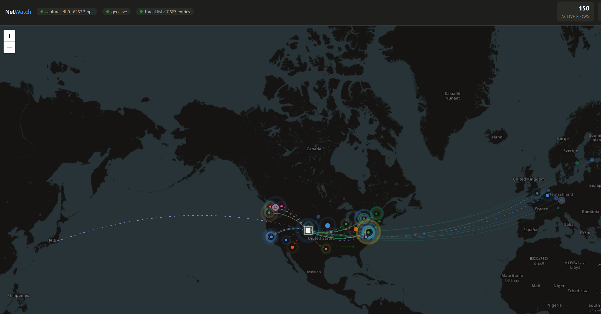

# NetWatch

**A live, network-wide world map of every device's internet connections — with
alerts, threat-intelligence flagging, history, and Pi-hole-bypass detection.**


-lightgrey)

-brightgreen)

NetWatch runs on a small always-on Linux box (a Raspberry Pi is ideal), watches a
**mirrored switch port**, and maps the real outbound connections of *every* device
on your LAN — phones, TVs, IoT and all — with the true remote IP, destination port,
and (for most HTTPS) the site's hostname read from the TLS SNI. It geolocates each
destination and plots it, colored by which device is responsible.

It also **alerts** on unusual activity, **flags known-bad IPs** against public
blocklists, keeps **30 days of history**, tracks **data volume** per device, and
detects devices trying to **bypass your Pi-hole** with their own external or
encrypted (DoH) DNS.

Pure Python 3 standard library — **nothing to install**.

> Just want to map a **single computer** without any switch setup? See the sibling
> project **[NetMap](../../netmap)**.

---

## Screenshots

| Devices & destinations | Alerts feed |
|---|---|
|  |  |

*The main view's left panel is a live world map (add a screenshot from your own
deployment for the best hero image). Devices are color-coded with upload/download
totals and badges for threats or Pi-hole bypass; the alerts feed is severity-coded.*

---

## Features

- **Whole-network visibility** from one mirrored port — every device, all protocols
- **Real endpoints + hostnames** (TLS SNI), not just DNS domains — catches traffic
  that never does a DNS lookup (hardcoded IPs, IoT phone-homes)
- **Alerts** on a device reaching a new country, hitting a known-bad IP, or
  bypassing your Pi-hole — in-app plus optional phone push (ntfy), webhook, or email
- **Threat-intelligence flagging** against Tor exit nodes, FireHOL level-1, and
  Spamhaus DROP (auto-refreshed); flagged destinations turn red
- **History** saved to SQLite with a 24-hour look-back view; 30-day retention
- **Data volume** (↑ upload / ↓ download) per device and destination
- **Pi-hole bypass detection** — flags devices doing their own external DNS or DoH
- Per-device map filtering, a searchable side panel, and a dark themed UI

## How it works (and its limits)

- The switch **mirrors** every packet crossing your internet uplink to a spare
  port; the Pi's wired NIC reads the copies.
- NetWatch parses only packet **headers** — addresses, ports, TLS SNI hostnames,
  and DNS answers. **No payloads are stored.** The only data leaving your network
  is the set of remote IPs sent to [ip-api.com](https://ip-api.com) for
  geolocation (cached locally).
- It records **outbound** flows (a LAN device → a public IP).
- HTTPS/TLS-over-TCP usually reveals the hostname via SNI. QUIC (UDP/443) is
  encrypted, so those show the real IP + reverse-DNS but not always a clean host.
- Under a fully saturated gigabit transfer the Pi may drop some mirrored packets
  (shown in the header). Harmless here — we only need *which* endpoints, not bytes.

## Requirements

- A Linux capture box with two network paths (a Raspberry Pi 4/5 is perfect: wired
  Ethernet for the mirror, Wi-Fi for its normal connection)
- A **managed switch with port mirroring** (SPAN). Most managed switches have it,
  including TP-Link Omada *Smart* switches.
- Python 3.9+ and root (raw packet capture)

---

## Setup

### 1. Wire it up

- **Pi Ethernet (eth0)** → the switch's **mirror/monitor port** (a receive-only
  copy of traffic).
- **Pi Wi-Fi (wlan0)** → your normal network (for geolocation and serving the map).
  Connect Wi-Fi first so the Pi stays reachable.

**Which port to mirror?** Mirror the port carrying all internet traffic — the link
between your switch and your router. If devices are split across two switches,
mirror on the switch the router plugs into and add the inter-switch link as a
second source port.

### 2. Enable port mirroring on the switch

On TP-Link Omada, in the controller: **Devices → (your switch) → Ports →** click the
monitor port → enable **Profile Overrides → Operation: Mirroring**, choose the
source port(s), set direction **Both**, **Apply**. (Other managed switches have an
equivalent "port mirror" / "SPAN" setting.)

### 3. Put it on the Pi

```bash
sudo mkdir -p /opt/netwatch
sudo cp netwatch.py /opt/netwatch/
sudo ip link set eth0 up          # the mirror port won't get an IP; that's fine
```

### 4. Run it

```bash
sudo python3 /opt/netwatch/netwatch.py --iface eth0 --pihole 192.168.1.2
```

Open **`http://<pi-wifi-ip>:8339`** from any browser on your network. The header's
**capture** pill should show packets-per-second climbing. Pass `--pihole` with each
Pi-hole IP so bypass detection knows which resolvers are sanctioned.

Preview the UI with fake traffic (no mirror, no root):

```bash
python3 netwatch.py --demo --host 127.0.0.1
```

| Flag | Description |
|------|-------------|
| `--iface NAME` | Capture interface (default `eth0`) |
| `--pihole IP` | Your Pi-hole IP(s); repeatable |
| `--port N` | Web server port (default 8339) |
| `--home LAT,LON` | Set map location manually |
| `--no-alerts` | Collect data but never send notifications |
| `--demo` | Synthesize traffic to preview the UI |

### 5. Run as a service (always-on)

```bash
sudo cp netwatch.service /etc/systemd/system/
# edit the ExecStart path/flags if needed (add your --pihole IP here)
sudo systemctl daemon-reload
sudo systemctl enable --now netwatch
```

### 6. Alerts & config (optional)

In-app alerts always work. For phone/email/webhook notifications and tuning, copy
[`netwatch.conf.example`](netwatch.conf.example) to `netwatch.conf` next to the
script and edit it (Pi-hole IPs, warm-up window, ntfy/webhook/email channels).
The config stays on your Pi and is read locally.

Alert severities: **critical** (threat-list hit), **warning** (Pi-hole bypass),
**notice** (new country), **info** (new destination, if enabled).

---

## Responsible use

NetWatch captures traffic metadata from a mirrored port. **Only deploy it on a
network you own or administer, and where users have appropriate notice.** Capturing
others' network traffic without authorization may be illegal in your jurisdiction.
NetWatch deliberately stores only connection metadata (addresses, ports, hostnames)
and never packet contents, but you are responsible for using it lawfully.

## License

[MIT](LICENSE) © 2026 huskerminion
